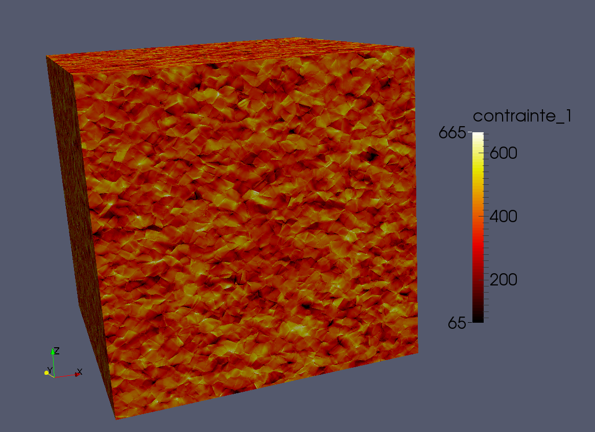

.. include:: ../rst_prolog.rst

.. empty first toctree is used for pdf contents maxdepth, see sphinx/builders/latex/__init__.py, toctrees[0].get('maxdepth')

.. toctree::
   :maxdepth: 2

.. _iraHome:

************
Py4amitex
************

.. warning:: #. This documentation is under construction.
             #. Find a *pdf* version of this documentation `here <py4amitexPdf_>`_ [1]_.

The py4amitex code is a Python package, is a set of Python3_ scripts files,
used to perform operations with `amitex_fft code <amitexPdf_>`_.

User's manual
==============

.. toctree::
   :maxdepth: 1

   introduction_manual
   tips

Programmer's guide
====================

.. toctree::
   :maxdepth: 1

   Prerequisites <prerequisites>
   Specific installations <installation>
   Usage <usage>
   Documentation HowTo <documentation>

Frequently Asked Questions
===========================
.. toctree::
   :maxdepth: 1

   FAQ <FAQ>

Release Notes
=============

.. toctree::
   :maxdepth: 1

   Release Notes 1.0.0 <release_notes/release_notes_1.0.0>

.. [1] py4amitex/doc/build/latex/py4amitex.pdf
